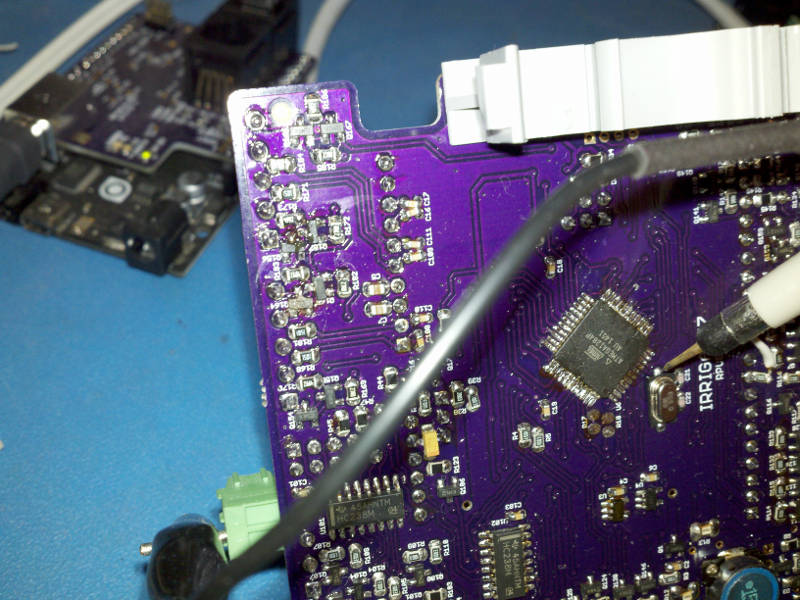
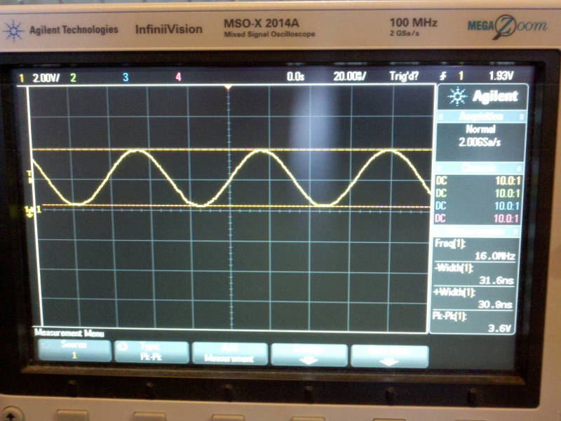
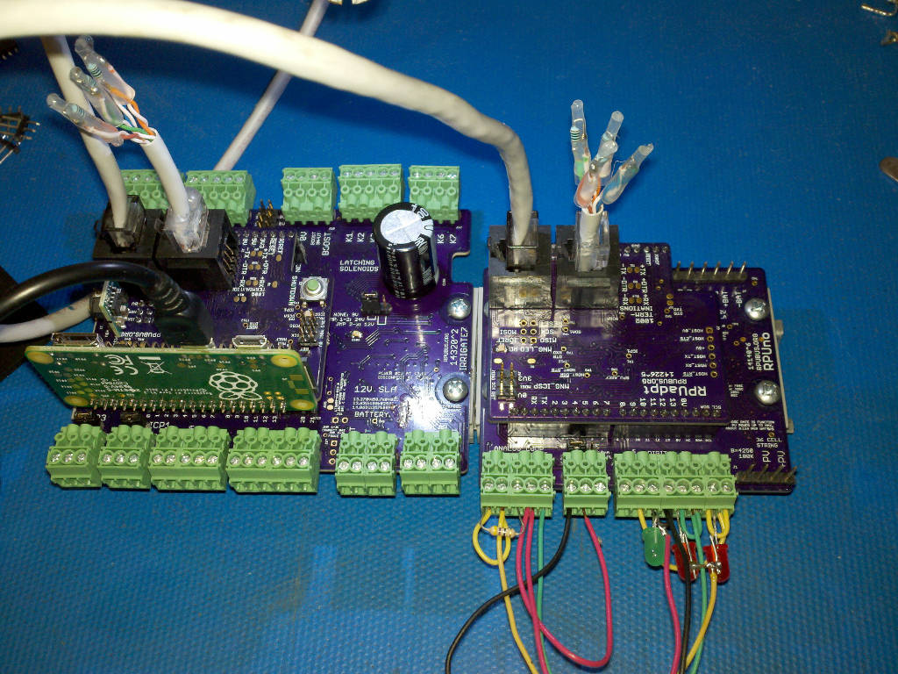
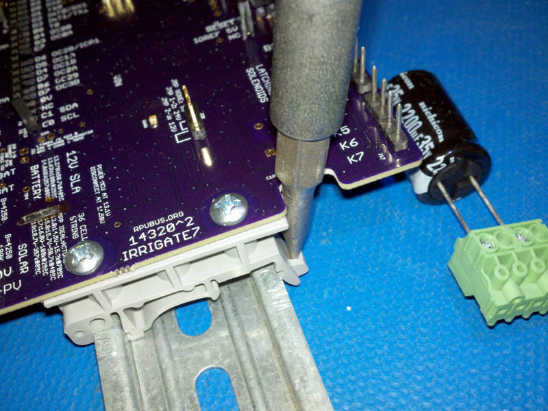
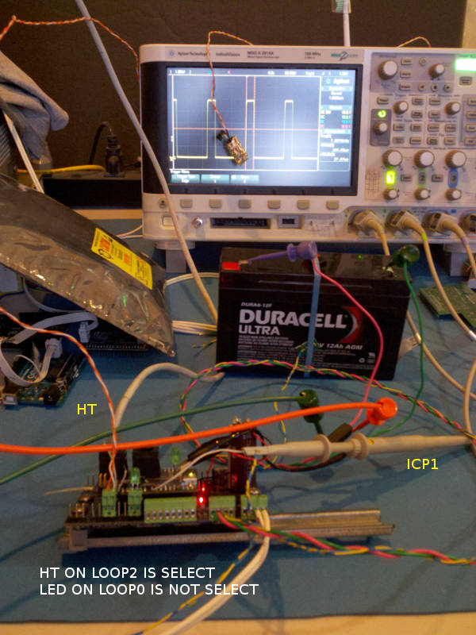
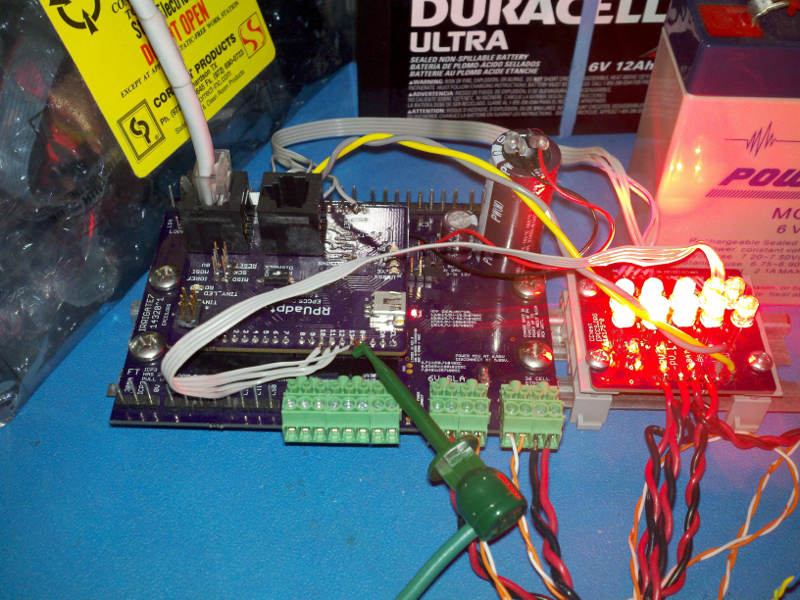
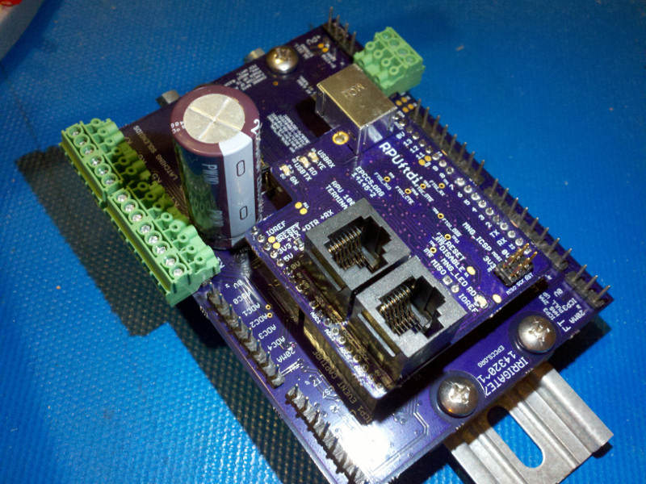
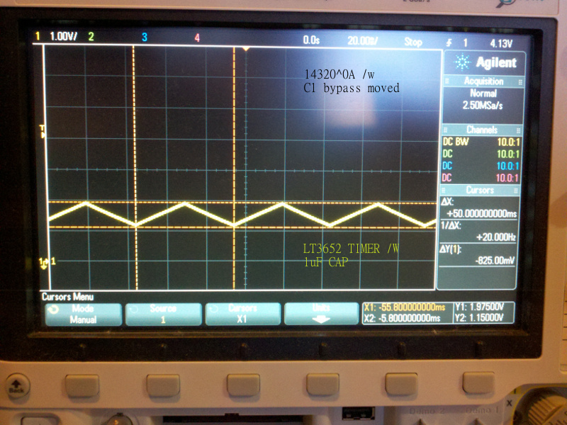

# Description

This shows the setup and method used for evaluation of Irrigate7.

# Table of References


# Table Of Contents:

7. ^2 Crystal Check
6. ^2 RS422 Shield
5. ^2 Lifting DIN Mount
4. ^1 Sensor Loop Select
3. ^1 CCtest
2. ^1 With RPUftdi^2
1. ^0A LT3652 Timer


## ^2 Crystal Check

The crystal has 27pF crystal capacitors which combine with the board's parasitic capacitance to make the crystals load capacitance.




Previous versions had a different crystal that needed less capacitance (which unfortunately got copied onto other boards).

## ^2 RS422 Shield

RPUpi and RPUadpt are RS422 shields that connect to controller boards serial (RX/TX) lines. The RPUpi crosses over the host computer (Pi Zero) serial lines to the RS422. As a result, the host can talk to both the ATmega1284p on Irrigate7 and the ATmega328p on RPUno through the multidrop interface. The microcontrollers are programmed with the GNU GCC toolchain for AVR which is available on Raspiban (an OS that runs on the Pi Zero). The toolchain can build firmware (projects) for both the RPUno and Irrigate7. 




## ^2 Lifting DIN Mount

A flat blade screwdriver is used to lift the DIN mount away from the rail, which is how almost all DIN systems work (though sometimes it is not this obvious).




## ^1 Sensor Loop Select

Using an [HT]^1 and [LoopPwr] firmware. The image shows a connection of the HT on LS2 and an LED on LS0. LS2 has ben selected and enabled with the firmware, and ICP1 is receving an inverted timing pulse from the sensor. See the [HT] for more info on the pulse sensor itself.

[HT]: https://github.com/epccs/LoopSensor/tree/master/HT
[LoopPwr]: ../../LoopPwr



Note the Loop Sensor Select circuits have been done on the [CL8] board and will be removed from Irrigate7. This will allow both ICP1 and ICP3 to connect with pulse sensors of all sorts, e.g. two flow sensors, or a flow sensor on ICP3 and a calibration volume with a start and stop signal on ICP1. Since both ICP1 and ICP3 are driven by the same crystal there is no error caused by the use of multiple clock sources. I was once confused by a string of technical words that went something like "double precision chronometry" which used two time sources, and that is actually less accurate than the use of a single time source (it was also not a floating point, counts are integers, I think it just plays well in the ears). I've also verified that the AVR clock domains between the IO and CPU are fully synchronized (and deterministic), which means that the capture is truly accurate to within one crystal count. Any system on chip (SOC) running over about 50MHz has to have a separate clock domain for its IO and that means the capture can occur with more randomness than one count. I am doubtful if consecutive captures with those high-speed SOC can be used to build up a larger capture count for increased resolution. 


## ^1 CCtest

Using a testboard and [CCtest] firmware. LD0 was connected to DIO 10, LD1 to DIO 11, LD2 to DIO 12, LD3 to DIO 13. Analog channel 2 was connected to measure PV_I (the solar current), channel 3 measures the charging current, and channel 4 measures the battery discharge current.

[CCtest]: ../../CCtest



```
# time to remove surface charge down to 6.45V
surface_milli_sec = 480302-406141
# 74161

# time to remove charge down to 6.40V
shallow_milli_sec = 722406 - 577157
# 145249 // dropping .05V has taken 71 Sec longer

# time to remove charge down to 6.35V
bulk_milli_sec = 3087073 - 890142
# 2196931 // dropping .1V has taken 2122.7 Sec longer

# I think the bulk rate of discharge holds true to about 6V 
# thus the battery was run at the discharge rate (Amps)
discharge_amp = .146
# for the time it takes to go from shallow (6.4V) to bulk (6.35V)
bulk_hr = (bulk_milli_sec - shallow_milli_sec)/(1000*3600)
bulk_tested = 0.05
bulk_range = 6.4 -6.0
bulk_multiplier= bulk_range/bulk_tested

# how much bulk seems available
AHr = bulk_hr*bulk_multiplier*discharge_amp
# .67 AHr // but the battery is rated for 7AHr, clearly somthing is wrong.
```


## ^1 With RPUftdi^2
 
This version places the 2200uF reservoir capacitor for driving the latching solenoid in a notch of the RPUftdi board. 


 

## ^0A LT3652 Timer

This was the first circuit where correct operation of the LT3652 timer was seen.
    

    
The LT3652 timer drivers an internal counter that is used to set the float charge time (so it counts when the battery voltage control loop is active). Once the float charge is done it turns off until the voltage drops enough to start charging again. I think the idea is to give the SLA a little rest time.
