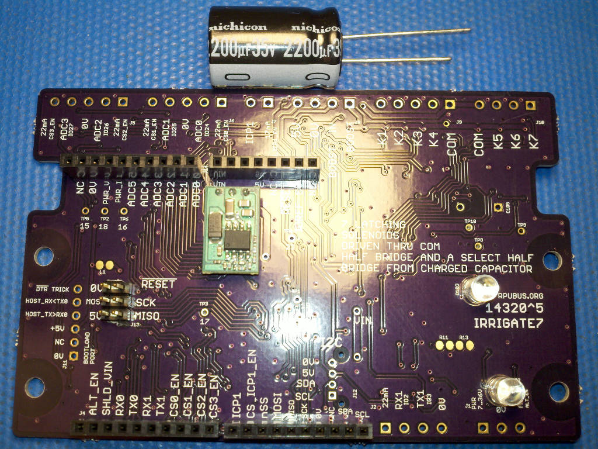

# Hardware

## Overview

This board is going through an over haul. It will retain the solenoid drivers, ICP1 loop, and ATmega1284p.

Bootloader options include [optiboot] and [xboot]. 

[optiboot]: https://github.com/Optiboot/optiboot
[xboot]: https://github.com/alexforencich/xboot

## Inputs/Outputs/Functions

```
        ATmega1284p is a easy to use microcontroller
        12V SLA with an LT3652 solar charge controller 
        High side battery current sensing ADC2 (Charging) and ADC3 (Discharging).
        Vin power will automatically disconnect when the battery is low (about 11.58V).
        Digital input/outputs (D TBD) with level shift.
        ICP1 for pulse type flow meter.
        Six Analog channels (ADC0..ADC5).
        Six Currrent sources (CS0..CS5) with enable for loop power.
        Power to the Shield Vin pin may be disabled (D 22).
        Input power 7..36 VDC.
```

## Uses

```
        Flow Meter Data Acquisition using Capture Hardware.
        SHLD_VIN to the shield can be powered down while ATmega1284p continues to run.
```

## Notice

```
        AREF from ATmega1284p is not connected to the header.
        3V3 is not present on the board, the header pin is not connected.
        Alt power input is for advanced DIY users that can repair their own boards.
```


# Table Of Contents

1. [Status](#status)
2. [Design](#design)
3. [Bill of Materials](#bill-of-materials)
4. [Assembly](#assembly)
5. [How To Use](#how-to-use)


# Status


```
        ^5  Done: 
            WIP: Design, 
            Todo: Layout, BOM, Review*, Order Boards, Assembly, Testing, Evaluation.
            remove LT3652 and all related parts
            add alternate power input and enalbe with digital TBD
            add level shift to ADC inputs (MIX)
            move nSS from D_5 to D_10 and use it for SPI 
            remove ICP3 input and use it for SPI
            remove D 12 and 13 and use for SPI
            use digital lines TBD to control CS0..CS5

        ^4  Done: Design, Layout, BOM, Review*, Order Boards,
            WIP: halt (the LT3652 was found to be useless with a 12V system).
            Todo: Assembly, Testing, Evaluation.
            *during review the Design may change without changing the revision.
            Via was placed on wires for LT3652 nSHDN and battery polarity protection on ^3 
            Add Test Points

        ^3  Done: Design, Layout, BOM, Review*, Order Boards, Assembly, Testing, 
            WIP: Evaluation.
            Todo: 
            *during review the Design may change without changing the revision.
            Pull up IO9 so it is not floating at power up.
            location: 2017-7-26 Storage (it may be used for Evaluation).

        ^2  Done: Design, Layout, BOM, Review*, Order Boards, Assembly, Testing,
            WIP: Evaluation.
            location: 2017-6-26 Test Bench.

        ^1  Done: Design, Layout, BOM, Review*, Order Boards, Assembly, Testing, Evaluation.
            location: 2016-5-13 Test Bench.
                      2017-6-12 scraped
```

Debugging and fixing problems i.e. [Schooling](./Schooling/)

Setup and methods used for [Evaluation](./Evaluation/)


# Design

The board is 0.063 thick, FR4, two layer, 1 oz copper with ENIG (gold) finish.




## Mounting

```
DIN rail
```

## Electrical Schematic


## Testing

Check correct assembly and function with [Testing](./Testing/)


# Bill of Materials

Import the [BOM](./Design/14320,BOM.csv) into LibreOffice Calc (or Excel), or use a text editor.


# Assembly

## SMD

The board is assembled with CHIPQUIK no-clean solder SMD291AX (RoHS non-compliant). 

The SMD [Reflow] is done with a small IR oven.

[Reflow]: https://github.com/epccs/RPUno/tree/master/Reflow


# How To Use

This board is like an [RPUno] but has an ATmega1284p and Latching solenoid drivers. The solenoid drivers are like [K3] but there are more of them. I have been running a K3 board with three latching valves controlled by an RPUno for over a year doing 10 cycles per day on each valve. 

[K3]: https://github.com/epccs/Driver/tree/master/K3
[RPUno]: https://github.com/epccs/RPUno/

Latching solenoids are widely available but they don't often say how to power them. I think it is because the idea of sending a current pulse to the coil is fairly complicated. Most of the coils will go up in smoke if the current flow is for very long. The pulse time is determined by the coil resistance and the size of capacitor discharged. Unfortunately, most manufacturers don't rate their products. So I sort of need to open one up and see what they are doing. For example, the battery-operated controller for my valves has a 2200uF capacitor that is charged to about 20V. To test the coil I charge a capacitor of that size to 12V and see if it can latch it, and then 24V. The risk of damage to the coil increases with capacitor size and voltage, so stay with 2200uF or a little less. It is probably worth trying to figure how reliable it latches at 12V (I end up using 24V). The board has a jumper to select 9V, 12V, or 24V.

If the solenoid driver bridge is shorted when the capacitor is discharged it will damage both the selected half bridge and the common half bridge. The bridge drives have a 17mA current source used to test for a shorted bridge before powering the boost converter. The 17mA test current is sent through a LED which should sort of flicker during normal operation, but if it stays on when D 15 is HIGH, then a half bridge has been damaged and the boost supply will not start. It is easy enough to find the short with a DMM, and reworking the SMD device should be possible, they are large SMD components (see the bill of materials for the parts I used). 

TBD