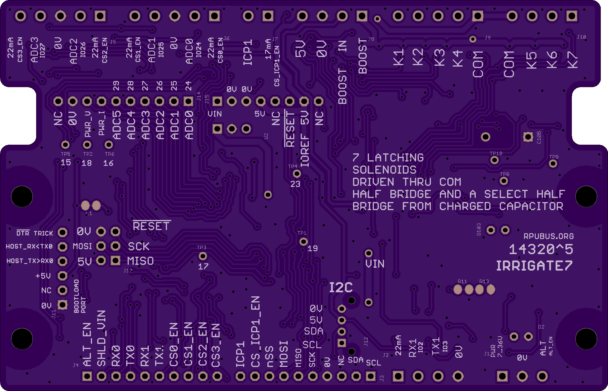
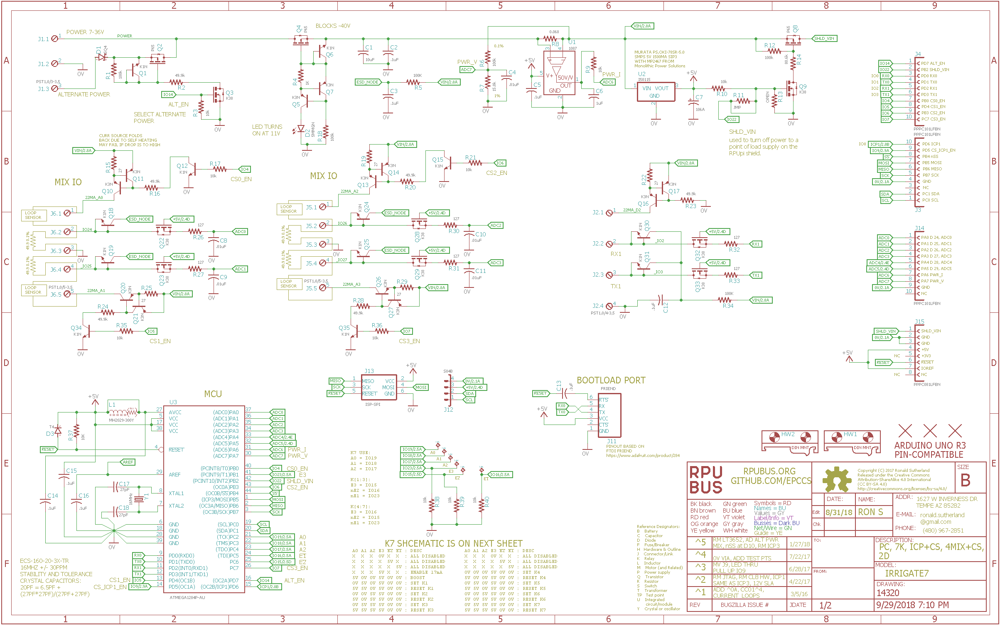

# Hardware

## Overview

This board is solar powered and has an ATmega1284p. It has two Input Capture (ICP1, ICP3) hardware units which each connect to an inverting open collector transistor that pulls down the respective ICP pin when current (e.g. >7mA) is flowing through a 100 Ohm sense resistor. The captured value is accurate to within one crystal (30ppm + drift) count of the pulse edge that caused the event. This captured value may for example be data acquisition of the rotating trubine in a flow meter. The board also has six digital interfaces with voltage level conversion, and four analog inputs each with current sources for current loops. The ATmega1284p can be programmed with the AVR toolchain on Debian, Ubuntu, Raspbian, and others. The toolchain is also available with the Arduino IDE, and PlatformIO.

Bootloader options include [optiboot] and [xboot]. Uploading through a bootloader eliminates fuse setting errors and there are few register settings that can block an upload accidentally (some other bootloaders don't clear the watchdog and can get stuck in a loop). This has given the feel of robustness during my software development experience.

[optiboot]: https://github.com/Optiboot/optiboot
[xboot]: https://github.com/alexforencich/xboot

## Inputs/Outputs/Functions

```
        ATmega1284p is a easy to use microcontroller
        12V SLA with an LT3652 solar charge controller 
        High side battery current sensing ADC2 (Charging) and ADC3 (Discharging).
        Vin power will automatically disconnect when the battery is low (about 11.58V).
        Seven pluggable digital input/outputs (DIO 2,3,4,10,11,12,13) with level conversion and ESD clamped.
        Digital interface has two 22 mA current source
        ICP1, ICP3 for flow meter or pulse type capacitive sensors e.g. LT or MT.
        Four Analog channels (ADC0, ADC1, ADC4, ADC6) each with 22mA current source for loop power.
        Currrent sources are turned off with DIO 9.
        Power to the Shield Vin pin is turned off with DIO 22.
        MCU power (+5V) is from an SMPS converted from the battery power.
```

## Uses

```
        Solar Powered Battery Backed General Purpose Controller
        Flow Meter Data Acquisition using Capture Hardware.
        SHLD_VIN to an RPUpi shield can be powered down while ATmega1284p continues to run.
```

## Notice

```
        AREF from ATmega1284p is not connected to the header.
        3V3 is not present on the board, the header pin is not connected.
```


# Table Of Contents

1. [Status](#status)
2. [Design](#design)
3. [Bill of Materials](#bill-of-materials)
4. [Assembly](#assembly)
5. [How To Use](#how-to-use)


# Status


```
        ^4  Done: Design, Layout, BOM, Review*,
            WIP: Order Boards,
            Todo: Assembly, Testing, Evaluation.
            *during review the Design may change without changing the revision.
            Via was placed on wires for LT3652 nSHDN and battery polarity protection on ^3 
            Add Test Points

        ^3  Done: Design, Layout, BOM, Review*, Order Boards, Assembly, Testing, 
            WIP: Evaluation.
            Todo: 
            *during review the Design may change without changing the revision.
            Pull up IO9 so it is not floating at power up.
            location: 2017-7-26 Storage (it may be used for Evaluation).

        ^2  Done: Design, Layout, BOM, Review*, Order Boards, Assembly, Testing,
            WIP: Evaluation.
            location: 2017-6-26 Test Bench.

        ^1  Done: Design, Layout, BOM, Review*, Order Boards, Assembly, Testing, Evaluation.
            location: 2016-5-13 Test Bench.
                      2017-6-12 scraped
```

Debugging and fixing problems i.e. [Schooling](./Schooling/)

Setup and methods used for [Evaluation](./Evaluation/)


# Design

The board is 0.063 thick, FR4, two layer, 1 oz copper with ENIG (gold) finish.





## Electrical Parameters (Typical)

```
PV Power Point Voltage: 18V7@0ºC,16V8@25ºC,15V7@40ºC,14V5@70ºC
PV Watage: 3 thrugh 20W
Max Power Point tracks 36 cell silicon PV with 100k B=4250 Thermistor
Charge Controler type: 12V SLA also tracks with 100k B=4250 Thermistor
Charge Voltage: 13.278V@40ºC,13.63V@25ºC,14.068V@0ºC
Charge rate: about .055A per PV watt at 25ºC
MCU type: ATmega1284p
MCU clock: 16MHz
MCU Voltage: 5V (e.g. IOREF is 5V)
CAPTURE INPUT: ICP1, ICP3
CAPTURE LOOP CURR SOURCE: two 17mA.
CAPTURE OC CURR SOURCE: two 10mA used with an open collector sensor.
DIGITAL: seven level translated (e.g. 12V from current source is safe, and will be translated to 5V for the MCU).
DIGITAL CURR SOURCES: two 22 mA from the 12V power.
ANALOG: four channels available to user (channels 0, 1, 4, 5)
ANALOG REFERENCE: internal 1.1V bandgap, VACC pin of ATmega1284p is tied 5V from OKI-78SR-5.0 SMPS.
ANALOG LOOP CURR SOURCES: four 22 mA from the 12V power.
```

## Mounting

```
DIN rail
```

## Electrical Schematic




## Testing

Check correct assembly and function with [Testing](./Testing/)


# Bill of Materials

Import the [BOM](./Design/14320,BOM.csv) into LibreOffice Calc (or Excel), or use a text editor.


# Assembly

## SMD

The board is assembled with CHIPQUIK no-clean solder SMD291AX (RoHS non-compliant). 

The SMD reflow is done in a Black & Decker Model NO. TO1303SB which has the heating elements controlled by a Solid State Relay and an ATMega328p loaded with this [Reflow] firmware.

[Reflow]: ../Reflow

## 100k Ohm Thermistor

The LT3652 has a control loop for regulating the input voltage, which can be compensated to track the maximum power point of silicon photovoltaic string (36 cell's in this case). The power point of a silicon PV cell is well known and so is the amount it changes with temperature, so compensation is possible.

Another control loop in the LT3652 is for regulating the SLA voltage, which needs to be compensated so that the charging voltage tracks with temperature to prevent battery damage.

Both are compensated with a 100k Thermistor which is placed on a short wire mounted in heat shrink with some thermoplastic and connected to the pluggable screw terminals. When in use the installer will need to place one of the thermistor under the PV panel and the other thermistor near the battery. Use a sunlight resistant cable between the PV panel and the enclosure, and for the battery temperature sensor use wiring appropriate for the enclosure. These sensors should be wired with twisted pair to minimize injecting noise into the charge controller.   


# How To Use

Fully charge the SLA battery that will be used, this step will allow the microcontroller to receive power quickly rather than waiting for the charge controller to charge it to about 13.1V.

Connect the application electronics (e.g. flow meter, analog current loops, and whatever the application uses) and check the connections. Then connect the battery (which will remain electronically disconnected). Next, connect the solar photovoltaic power, once the PV voltage is enough to enable the charger it will electronically connect to the battery, and start charging (though nothing is visible yet, and this has caused some frustration). When the battery voltage is over 13.1V it will connect to the on board VIN node and power the microcontroller. The buffered power ensures hiccup free operation. 

In some ways, this board is like an [RPUno], with the same interface dedicated to the onboard hardware.  Digital lines IO5, IO6, IO7 are connected to the solar charge controller. Digital line IO9 is used to control current sources.  Four analog lines ADC7, ADC6, ADC3, ADC2 are used to measure the battery PWR voltage, PV_IN voltage, CHRG, and DISCHRG. However, this board has a ATmega1284p so IO2 is available and IO22 is used to control power to the SHLD_VIN. Four analog lines ADC0, ADC1, ADC4, ADC5 are available to the user. The I2C lines do not use ADC4 and ADC5 like on the ATmega328p.

Latching solenoids are widely available but they don't often say how to power them. I think it is because the idea of sending a current pulse to the coil is fairly complicated. Most of the coils will go up in smoke if the current flow is for very long. The pulse time is determined by the coil resistance and the size of capacitor discharged. Unfortunately, most manufacturers don't rate their products. So I sort of need to open one up and see what they are doing. For example, the battery-operated controller for my valves has a 2200uF capacitor that is charged to about 20V. To test the coil I charge a capacitor of that size to 12V and see if it can latch it, and then 24V. The risk of damage to the coil increases with capacitor size and voltage, so stay with 2200uF or a little less. It is probably worth trying to figure how reliable it latches at 12V (I end up using 24V). The board has a jumper to select 9V, 12V, or 24V.

If the solenoid driver bridge is shorted when the capacitor is discharged it will smoke both selected half bridge and the common half bridge. The bridge drives have a 17mA current source used to test for a shorted bridge before powering the boost converter. The 17mA test current is sent through a LED which should sort of flutter during normal operation, but if it stays on when IO15 is HIGH, then a half bridge has been damaged and the boost supply will not start. It is easy enough to find the short with a DMM, and reworking is possible if you are comfortable with large SMD components (see the bill of materials for the exact parts I used). 

TBD