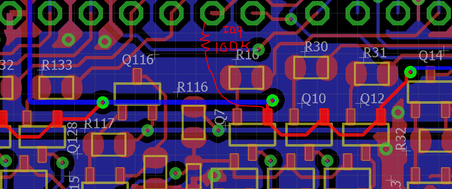
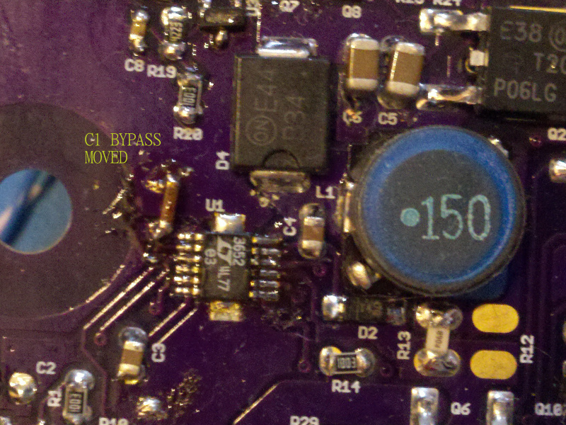
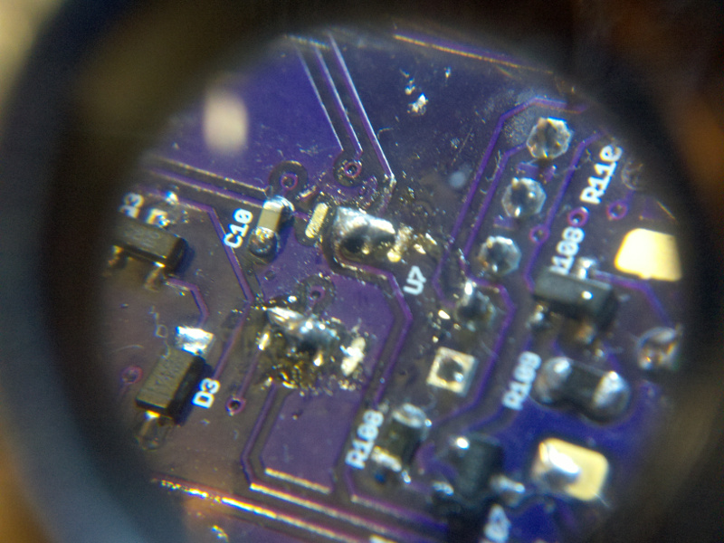
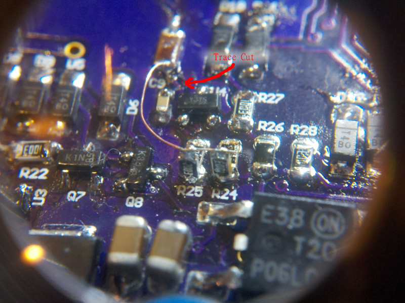

# Description

Some lessons I learned doing Irrigate7.

# Table Of Contents:

10. ^3 Via on Wires
9. ^2 Digital IO Protection Resistor
8. ^2 Pull Up IO9
7. ^1 RPUno
6. ^1 CL8
5. ^1 K3
4. ^1 Digital IO Current Limit Resistor
3. ^0 C1 Bypass Moved to LT3652 VIN
2. ^0 LMV358 Does Not have 5V Befor Battery Connect
1. ^0 C11 Interference with HW1 (DIN mount)

## ^3 Via on Wires

How are my going to explain this to the boss? I even remember seeing the via while doing cleanup to the layout, something distracted me I guess.

## ^2 Digital IO Protection Resistor

The level shifting NMOS will provide the protection resistor between 4.5V and 3.5V and at 40mA the MCU pin voltage is over 0.5V, this all adds up to using a lower value protection resistor. If it is 100 Ohms then at one of the NMOS extremes it will have 4.5V on one side and .5V on the other and thus a 4V drop, which means 40mA.

The reason I am looking at this is that both DIO13 and DIO12 are unable to sink all of a 22mA current source with the 182 Ohm resistor that is presently used as a protection resistor. Measurements indicate the NMOS side has about 3.7V and the MCU pin has 0.35V, which means the most it could ever sink is about 19mA (with 100 Ohm protection it should be able to sink about 32mA).

The life expectancy of the MCU pin is somewhat dependent on how much current it sinks, at 20mA it should last forever (e.g. >20 years), however at 40mA the life expectancy is short (perhaps a few weeks). 

## ^2 Pull Up IO9

Found Current sources only able to give a a few mA durring testing since IO9 is floating, add a pullup so it workes in a defined way after power up.

## ^1 RPUno

[RPUno] went from ^2 to ^6, and the updates for RPUno are valid for the next version of Irrigate7.

[RPUno]: https://github.com/epccs/RPUno

## ^1 CL8 

The [CL8] board was done based on Irrigate7^1's current loop sensors.

[CL8]: https://github.com/epccs/Driver/tree/master/CL8

The current loop selection is going to be removed from the next version so that the ICP1 can be used as a general purpose sensor input, e.g. either a flow sensor or selectable pulse sensors (with the CL8 board) can be connected.

## ^1 K3 

The [K3] board was done based on Irrigate7^1's solenoid drivers, and it has updates.

[K3]: https://github.com/epccs/Driver/tree/master/K3

## ^1 Digital IO Current Limit Resistor 

Should go between K38 and MCU.

## ^0 C1 Bypass Moved to LT3652 VIN

Bypass does not work on the PV input like it seems to on CC01, so after some trial and error I found it was in fact needed at the LT3652 VIN pin. I thought for sure the 10uF was close enough, but it does not act like the 100nF bypass.

This move also got the LT3652 TIMER (C3) working better than I've seen, so I tried it on the CC01 board as well and the float time repeats now,  I think that is the general location to put it.

## ^0 LMV358 Does Not have 5V Befor Battery Connect

I checked that the charge control circuit was working befor populating the MCU and other items. But then found the battery would not connect and U4 only had .65V on its referance input while PWR node had 6.25V. After some hair pulling it turned out the LMV358 positive rail has zero voltes and prevents teh TLVH431 from sensing the 6V level to connect. First step is to remove Op-Amp*, then read up on the AVR ADC to see if resistor dividers can be made to work.

Removed the Op-Amp. Next add the resistor dividers to measure voltages. Also add a decoupling capacitor so the sample and hold capacitor has low impedance to read the value, and I can use high resistance for the divider.

So that worked, the ADC can read the value and the power loss is low (it is also SMD art).

## ^0 C11 Interference with HW1 (DIN mount)

Layout error. 

