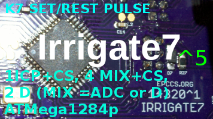

# Irrigate7 

From <https://github.com/epccs/Irrigate7/>

## Overview

This ATmega1284p based controller board has seven half H-bridge and a common half H-bride to control seven Latching (or Holding) Solenoids, a Capture input for timing pulse events (e.g. turbine rotation of a flow meter), and four Analog inputs with current sources to control and measure loop sensors (e.g. pressure, temperature...). Power with 7 thru 36V DC.

It is similar to the [RPUno] but has integrated K7 (which is a scaled up [K3]). It's MCU is connected to headers that work with the [RPUpi], or [RPUadpt] shields. The bootload port works with [USBuart].

[K3]: https://github.com/epccs/Driver/tree/master/K3
[RPUno]: https://github.com/epccs/RPUno
[RPUpi]: https://github.com/epccs/RPUpi
[RPUadpt]: https://github.com/epccs/RPUadpt
[USBuart]: https://github.com/epccs/Driver/tree/master/USBuart

[Forum](https://rpubus.org/bb/viewforum.php?f=17)

[HackaDay](https://hackaday.io/project/25599-irrigate7-m1284p-board-for-holding-solenoids)

## Status

[](https://travis-ci.org/epccs/Irrigate7)



## [Hardware](./Hardware)

Hardware files include schematic, bill of materials, and notes for testing and evaluation. The [Eagle] files are kept in a different location.

[Eagle]: https://github.com/epccs/Eagle/tree/master/Irrigate7

## Example with RPU BUS 

RPUBUS is a serial bus that allows multiple controller boards to be connected to a host computer serial port. An [RPUpi] shield has a connector for a Pi Zero to act as the host computer, and connect to other boards with a [RPUadpt] shield over a daisy-chain of CAT5 cables. 


The host computer is able to use it's serial UART port with common software (e.g. avrdude, PySerial, picocom...) when communicating with the ATmega1284p. 


## AVR toolchain

The core files for this board are in the /lib folder. Each example has its files and a Makefile in its own folder. The toolchain packages that I use are available on Ubuntu and Raspbian. 

```
sudo apt-get install make git gcc-avr binutils-avr gdb-avr avr-libc avrdude
git clone https://github.com/epccs/Irrigate7
```

* [gcc-avr](https://packages.ubuntu.com/search?keywords=gcc-avr)
* [binutils-avr](https://packages.ubuntu.com/search?keywords=binutils-avr)
* [gdb-avr](https://packages.ubuntu.com/search?keywords=gdb-avr)
* [avr-libc](https://packages.ubuntu.com/search?keywords=avr-libc)
* [avrdude](https://packages.ubuntu.com/search?keywords=avrdude)

I place an [Bootloader] on the bare metal microcontroller with a fuse step and a step that uploads using an ISP tool. 

[Bootloader]: https://github.com/epccs/Irrigate7/tree/master/Bootloader

```
cd Irrigate7/Bootloader
# note /dev/ttyACM0 is my ICSP tool.
make fuse
make isp
```

The other applications are loaded through the bootloader using the host serial port. Note that the fuse cannot be changed with the bootloader thus reducing user issues with an application upload.

```
cd ~/Irrigate7/Adc
# note /dev/ttyUSB0 is a FTDI USBuart, and /dev/ttyAMA0 is a Raspberry Pi
make bootload
```

The software is a guide, it is in C because that is my preference for microcontrollers. If you want additional software please add a Github issue to this repository where we can discuss it. 


## Continuous Integration

Continuous Integration (CI) is the practice of automatically compiling and testing each time the mainline source is updated (e.g. git push). Travis CI is using a version of Ubuntu as there host environment for doing the test build. The build machine allows pulling in any packages I want including the AVR cross compiler. I don't do anything fancy, just run make. A rule like "make test" could be used if the test build machine had hardware connected (e.g. "make bootload" and then "make test") to the machine, but that is not practical in the foreseeable future. This was fairly simple to set up for Travis because the ATmega1284p was in production at the time the Ubuntu toolchain was done.

[https://travis-ci.org/epccs/Irrigate7](https://travis-ci.org/epccs/Irrigate7)

Update: Travis has Ubuntu [Xenial] 16.04.

[Xenial]: https://docs.travis-ci.com/user/reference/xenial/


## Arduino IDE with MightyCore

The Arduino [IDE] can use the [MightyCore] to compile programs, however I use my [core] files (which are C rather than C++), just remember to look at the schematic to see how the microcontroller is connected. I do not use the Arduino IDE or C++ (I am a hardware designer,.and have enough intrest in software to do what I want).

[IDE]: https://www.arduino.cc/
[MightyCore]: https://github.com/mcudude/MightyCore
[core]: https://github.com/epccs/Irrigate7/tree/master/lib


## Visual Studio Code

VSC is an editor with some IDE features, it is happy with Makefiles. The feature that is driving me to use VSC is [IntelliSense]. It is configured with JSON files in [.vscode]. 

[IntelliSense]: https://code.visualstudio.com/docs/editor/intellisense
[.vscode]: https://github.com/epccs/Irrigate7/tree/master/.vscode

IntelliSense needs access to the toolchain includes. The AVR toolchain has some in avr-libc (/usr/lib/avr/include), and gcc-avr (/usr/lib/gcc/avr/5.4.0/include). So I copy them into a Samba share for VSC to see (e.g. Y:/lib/avr-libc, and Y:/lib/gcc-avr) which is also where I edit the source (e.g. Y:/git/Irrigate7).

VSC is becoming popular Sparkfun has a [tutorial] on how to use it with Arduino's C++ Library (9_9).

[tutorial]: https://learn.sparkfun.com/tutorials/efficient-arduino-programming-with-arduino-cli-and-visual-studio-code/all